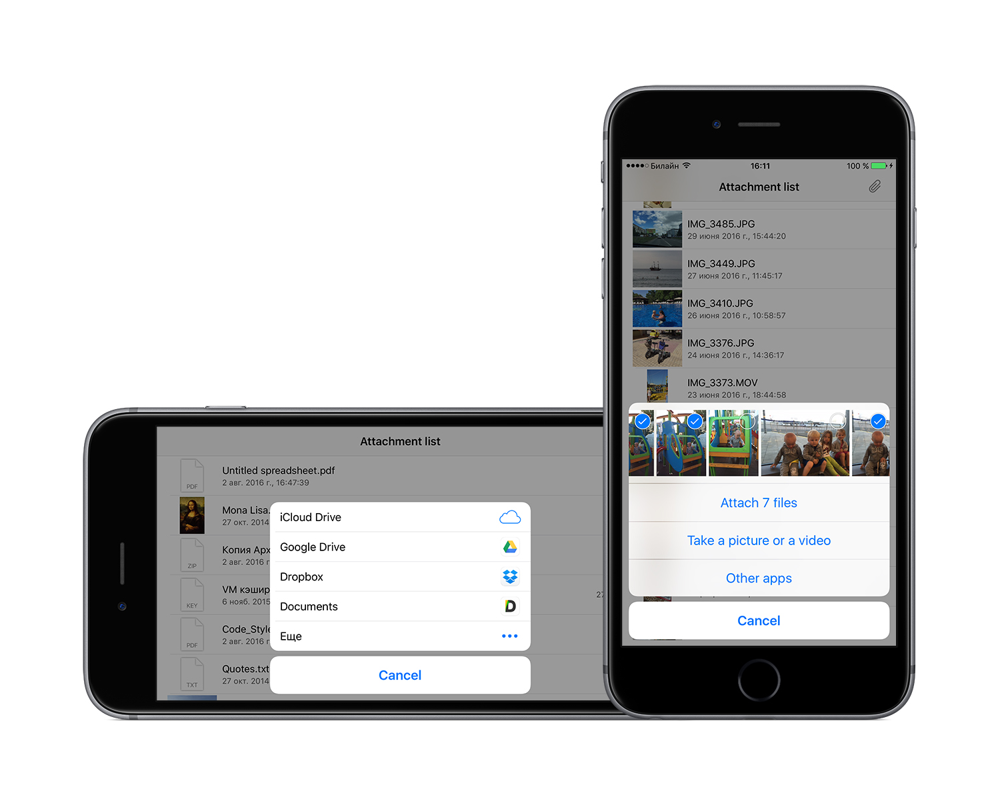
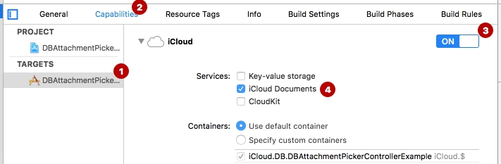

# DBAttachmentPickerController
[](http://cocoadocs.org/docsets/DBAttachmentPickerController)
[](http://cocoadocs.org/docsets/DBAttachmentPickerController)
[](http://cocoadocs.org/docsets/DBAttachmentPickerController)


This powerful component allows to select different types of files from different sources on your device. 



## Preview


## Requirements

- iOS 8.0+

## Adding to your project

### Cocoapods

To add DBAttachmentPickerController via [CocoaPods](http://cocoapods.org/) into your project:

1. Add a pod entry for DBAttachmentPickerController to your Podfile `pod 'DBAttachmentPickerController', '~> 1.1.0'`
2. Install the pod by running `pod install`

### Source Files

To add DBAttachmentPickerController manually into your project: 

1. Download the latest code, using `git clone`
2. Open your project in Xcode, then drag and drop entire contents of the `Source` folder into your project (Make sure to select Copy items when asked if you extracted the code archive outside of your project)

## Usage

To use DBAttachmentPickerController in your project you should perform the following steps:

1. Initialize Attachment picker controller (see the [Constructors section](#constructors))
2. Specify additional options if nedded (see the [Property list section](#property-list))
3. Present Attachment picker controller (see the [Presentation section](#presentation))

```objc
- (void)addAttachment {
    // (1)
    DBAttachmentPickerController *attachmentPickerController = [DBAttachmentPickerController attachmentPickerControllerFinishPickingBlock:^(NSArray<DBAttachment *> * _Nonnull attachmentArray) {...} cancelBlock:^{...}];
    
    // (2)
    attachmentPickerController.mediaType = DBAttachmentMediaTypeImage | DBAttachmentMediaTypeVideo;
    attachmentPickerController.capturedVideoQulity = UIImagePickerControllerQualityTypeHigh;
    attachmentPickerController.allowsMultipleSelection = YES;
    attachmentPickerController.allowsSelectionFromOtherApps = YES;
    
    // (3)
    [attachmentPickerController presentOnViewController:self];
}
```

### Constructors

To initialize the attachment picker controller you have to call one of the following methods:

- `+attachmentPickerControllerFinishPickingBlock:cancelBlock:` - Creates and returns an attachment picker controller. As a result in the finishPickingBlock will be returned array of DBAttachment objects. [DBAttachment](#dbattachment) class provides more opportunities to process selected files but required additional processing to get result;
- `+imagePickerControllerFinishPickingBlock:cancelBlock:` - Creates and returns an attachment picker controller with constant media type (image). Other media types will be ignored. As a result in the finishPickingBlock will be returned array of UIImage objects;
- `+videoPickerControllerFinishPickingBlock:cancelBlock:` - Creates and returns an attachment picker controller with constant media type (video). Other media types will be ignored. As a result in the finishPickingBlock will be returned array of different objects depending on the source. Required additional processing to get result.

### Property list

You can change additional Attachment Picker Controller properties. Full properties list is shown below:

- `UIView *senderView` - Used to provide opportunity to correctly calculate position popover view when app works on iPad. You can specify UIButton, UITableViewCell, etc. instance to which the user touched. ATTENTION: The parameter must contain only UIView subclass instance or nil;
- `DBAttachmentMediaType mediaType` - It's determine the types of attachments that can be picked. Default is DBAttachmentMediaTypeMaskAll;
- `UIImagePickerControllerQualityType capturedVideoQulity` - Used to determine the quality of the captured video from camera. Default is UIImagePickerControllerQualityTypeMedium;
- `BOOL allowsSelectionFromOtherApps` - Used to add Other Apps button. ATTENTION: To correctly work this option you must select iCloud Documents 
 capability on project settings. To view detail information, see [Usage Document Picker section](#usage-document-picker-(other-apps-button)). Default is NO.
- `BOOL allowsMultipleSelection` - Used to allow multiple selection where it possible. Default is NO.

### Presentation

After creation Attachment Picker Controller you should set additional options if needed (see the [Property list section](#property-list)) and present it. 

- `-presentOnViewController:` - Present attachment picker controller on specify UIViewController.

## Usage Document Picker (Other apps button)

To usage Document Picker you must:

- set YES value to `AllowsSelectionFromOtherApps` property
- turn on the iCloud Documents capabilities in Xcode (see image later)




## DBAttachment

The class contain metadata about selected item. 

You can use following properties to get metadata of file: 

- `NSString *fileName` - The name of the file. Can be empty;
- `NSDate *creationDate` - Creation date of the file. Can be nil;
- `NSUInteger fileSize` - Size of the file in byte. Available only for existing files. ATTENTION: If you want get file size for PHAsset or something like that, you should calculate it after getting file data; 
- `NSString *fileSizeStr` - Formatted string of file size. Can be empty. 

To get thumbnail image you should call folowing method: `-loadThumbnailImageWithTargetSize:completion:`. Or you can get original image through method `-loadOriginalImageWithCompletion:`.

Also you can get original file data if call appropriate method `-originalFileResource`.

## Version history

### 1.1.0
- Added localization. Available following languages: English (Default), Russian, Spanish, German, French, Ukrainian, Chinese (Simplified and Traditional) and Japanese.
- Added description for methods and properties on DBAttachment class. 

## Contact

Denis Bogatyrev (maintainer)

- https://github.com/d0ping
- denis.bogatyrev@gmail.com

##License

DBAttachmentPickerController - Copyright (c) 2016 Denis Bogatyrev

Permission is hereby granted, free of charge, to any person obtaining a copy of this software and associated documentation files (the "Software"), to deal in the Software without restriction, including without limitation the rights to use, copy, modify, merge, publish, distribute, sublicense, and/or sell copies of the Software, and to permit persons to whom the Software is furnished to do so, subject to the following conditions:

The above copyright notice and this permission notice shall be included in all copies or substantial portions of the Software.

THE SOFTWARE IS PROVIDED "AS IS", WITHOUT WARRANTY OF ANY KIND, EXPRESS OR IMPLIED, INCLUDING BUT NOT LIMITED TO THE WARRANTIES OF MERCHANTABILITY, FITNESS FOR A PARTICULAR PURPOSE AND NONINFRINGEMENT. IN NO EVENT SHALL THE AUTHORS OR COPYRIGHT HOLDERS BE LIABLE FOR ANY CLAIM, DAMAGES OR OTHER LIABILITY, WHETHER IN AN ACTION OF CONTRACT, TORT OR OTHERWISE, ARISING FROM, OUT OF OR IN CONNECTION WITH THE SOFTWARE OR THE USE OR OTHER DEALINGS IN THE SOFTWARE.
